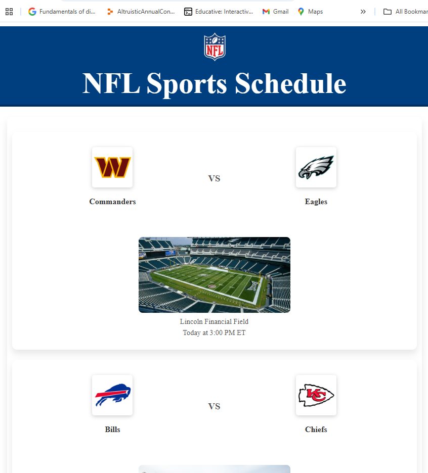
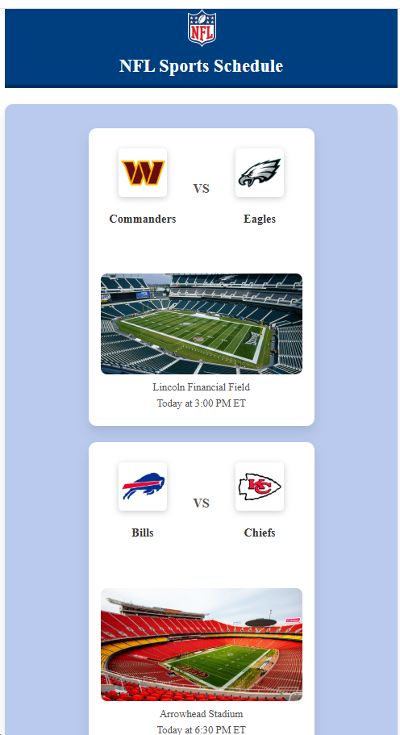

# Building a Scalable NFL Schedule API With AWS and Docker

## **Overview**
This project is part of my #30DaysDevOpsChallenge and is my most technically challenging project to date. The goal was to create a **containerized NFL Schedule API Management System** that fetches, processes, and displays real-time NFL schedules efficiently.

This system utilizes **AWS ECS (Fargate), API Gateway, Docker, and JavaScript frontend** to provide a **fully scalable, automated, and visually appealing** solution.

This project showcases advanced cloud computing practices, including:

**API Management**
**Container Orchestration**
**Secure AWS Integrations**

## **Features**
✅ **Fetch real-time NFL schedules** from an external sports API.
✅ **Serve schedules efficiently** through a containerized backend using AWS ECS.
✅ **Visually appealing and responsive frontend** with JavaScript, CSS, and HTML.
✅ **Scalable & Secure API management** using AWS API Gateway.
✅ **Fully automated deployment** with Docker containerization.

---

## **Architecture & Technologies Used**
- **AWS ECS (Fargate)** → Manages containerized applications.
- **AWS API Gateway** → Secure API access and routing.
- **Docker** → Ensures portability and consistency.
- **Python (Flask)** → Backend API logic.
- **JavaScript, HTML, CSS** → Frontend UI for displaying schedules.

---
## **Prerequisites**
**Sports API Key**: Obtain an API key from a provider like Serpapi or a similar service
**AWS Account**: Create an AWS Account and have a basic understanding of ECS, API Gateway, Docker, and Python.
**AWS CLI Installed and Configured**: Install and configure the AWS CLI to interact with AWS programmatically.
**Python Library (Sport Specific)**: Install the appropriate Python library for your chosen sports data provider (e.g., google-search-results for SerpApi).
**Docker CLI and Desktop Installed**: Required for building and pushing container images.


---


## **How It Works**

### **Step 1: Clone the Repository**

```bash
git clone https://github.com/danielhensha2/sports-api-management-system.git

cd sports-api-management
```

## **Step 2:Create an ECR Repository**
```bash
aws ecr create-repository --repository-name sports-api --region <your-region>
```

### **Step 3: Dockerizing the Backend**
The backend is a Flask API that retrieves and serves NFL schedules. The application is containerized using **Docker**, ensuring consistency across different environments.
```bash
# Build the Docker image
docker build -t sports-api .
```

### **Step 4: Deploying to AWS ECS (Fargate)**
Amazon ECS (Fargate) is used to deploy and manage the containers efficiently.
```bash
# Push to AWS ECR
docker tag sports-api:latest <AWS_ACCOUNT_ID>.dkr.ecr.us-east-1.amazonaws.com/sports-api:latest
docker push <AWS_ACCOUNT_ID>.dkr.ecr.us-east-1.amazonaws.com/sports-api:latest
```

### **Step 5: Creating the ECS Cluster and Service**
An ECS cluster is created to run the containerized application with **2 running tasks** for high availability.

### **Step 6: Setting Up API Gateway**
AWS API Gateway is configured to expose the backend API securely.
- **GET** method created for API access.
- **CORS configured** to allow frontend interaction.

### **Step 7: Fetching Real-Time JSON Data**
Users can access real-time NFL schedules by querying the API Gateway URL.
```bash
curl https://<api-gateway-id>.execute-api.us-east-1.amazonaws.com/prod/sports
```


### **Step 8: Building a Frontend UI**
A **fully responsive frontend** is created using JavaScript, CSS, and HTML. This UI fetches and displays NFL schedules in a visually appealing format.

**Desktop View**


---


**Mobile View**



---

## **Key Challenges & Solutions**
### **1. Docker Credential Config Issue**
✅ Fixed by updating **credsStore** to **credstore** in `config.json`.

### **2. API Gateway CORS Issues**
✅ Resolved by setting proper **Access-Control-Allow-Origin** headers.

### **3. Debugging Proxy Requests**
✅ Implemented a proxy to forward API requests, ensuring smooth frontend-backend communication.

---

## **Future Enhancements**
🚀 **Caching with Amazon ElastiCache** → Faster API response times.
🚀 **Database Integration (DynamoDB)** → Store user preferences and schedule history.
🚀 **CI/CD Automation** → Enable continuous deployment and updates.

---

## **Project Links**
📌 **LinkedIn:** [www.linkedin.com/in/daniel-osarobo](www.linkedin.com/in/daniel-osarobo)
📌 **Read more about this project on Medium:** [When Docker Meets AWS: Building a Scalable NFL Schedule API](https://medium.com/@danielosarobo/when-docker-meets-aws-building-a-scalable-nfl-schedule-api-2966c2ce3895)
🔹 **Follow my journey as I complete the #30DaysDevOpsChallenge!** 🚀
